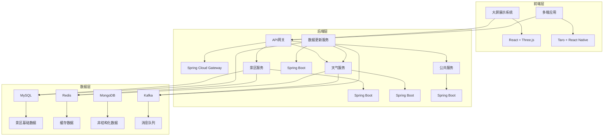

# 中国文旅地球仪技术架构设计

## 1. 技术架构总览

### 1.1 架构风格
- **前端**：响应式Web应用 + 跨平台移动应用
- **后端**：微服务架构
- **数据层**：混合存储方案
- **部署**：容器化部署

### 1.2 技术栈选择

| 分类 | 技术 | 版本 | 选型理由 |
|------|------|------|----------|
| **前端** | React | 18.x | 组件化开发，生态丰富，适合构建复杂前端应用 |
| | Three.js | 0.160.x | 高性能3D渲染库，适合实现地球仪效果 |
| | Redux Toolkit | 1.9.x | 状态管理，简化数据流 |
| | React Native | 0.72.x | 跨平台移动应用开发，支持iOS和Android |
| | Taro | 3.x | 支持小程序、H5、React Native多端开发 |
| **后端** | Spring Boot | 3.2.x | 快速构建RESTful API，生态成熟 |
| | Spring Cloud | 2023.x | 微服务架构支持，服务注册与发现 |
| | Spring Security | 6.2.x | 安全认证与授权 |
| **数据存储** | MySQL | 8.0+ | 关系型数据库，存储景区基础信息 |
| | Redis | 7.0+ | 缓存天气数据和热点景区信息 |
| | MongoDB | 6.0+ | 存储非结构化数据，如景区图片元数据 |
| **消息队列** | Kafka | 3.5.x | 数据更新和实时推送 |
| **定时任务** | Spring Scheduler | - | 静态数据定时更新 |
| **部署** | Docker | 20.10+ | 容器化部署 |
| | Kubernetes | 1.27+ | 容器编排和管理 |
| **监控** | Prometheus | 2.45+ | 系统监控 |
| | Grafana | 10.0+ | 监控数据可视化 |

## 2. 前端架构设计

### 2.1 大屏展示系统
- **核心技术**：React + Three.js
- **功能模块**：
  - 3D地球仪渲染模块
  - 景区标记与交互模块
  - 景区信息展示模块
  - 天气数据展示模块
- **性能优化**：
  - 使用WebGL加速3D渲染
  - 实现LOD (Level of Detail) 技术，根据缩放级别显示不同精度的地图
  - 图片懒加载
  - 数据缓存策略

### 2.2 多端适配方案
- **核心技术**：Taro + React Native
- **适配端**：
  - 小程序（微信、支付宝等）
  - 鸿蒙
  - iOS
  - 安卓
  - PC端
- **适配策略**：
  - 使用Taro的多端编译能力
  - 响应式布局，根据设备屏幕尺寸调整界面
  - 针对不同设备优化交互体验

### 2.3 前端状态管理
- **核心技术**：Redux Toolkit
- **状态管理模块**：
  - 景区数据状态
  - 天气数据状态
  - 用户交互状态
  - 应用配置状态

### 2.4 前后端交互
- **API调用**：使用Axios进行RESTful API调用
- **实时数据**：使用WebSocket接收实时天气数据
- **缓存策略**：
  - 本地缓存：使用localStorage存储静态数据
  - 内存缓存：使用Redux存储频繁访问的数据
  - 缓存失效策略：基于时间和数据更新频率

## 3. 后端架构设计

### 3.1 微服务架构
- **服务拆分**：
  - `api-gateway`：API网关，处理请求路由和认证
  - `scenic-service`：景区信息服务
  - `weather-service`：天气数据服务
  - `data-update-service`：数据更新服务
  - `common-service`：公共服务，提供通用功能

### 3.2 服务通信
- **同步通信**：使用RESTful API
- **异步通信**：使用Kafka消息队列
- **服务注册与发现**：使用Eureka
- **配置中心**：使用Spring Cloud Config

### 3.3 数据更新机制
- **静态数据更新**：
  - 使用Spring Scheduler定时任务
  - 每日或每周更新景区基础信息
- **动态数据更新**：
  - 天气数据每20-30分钟更新一次
  - 使用Kafka推送更新数据

### 3.4 安全设计
- **认证机制**：使用JWT进行身份认证
- **授权机制**：基于角色的访问控制（RBAC）
- **数据加密**：HTTPS传输，敏感数据加密存储
- **防护措施**：防止SQL注入、XSS攻击等

## 4. 数据存储方案

### 4.1 数据库设计
- **MySQL数据库**：
  - `scenic_spot`：景区基础信息表
  - `scenic_level`：景区等级表
  - `scenic_image`：景区图片表
  - `scenic_ticket`：景区票价表
  - `weather_data`：天气数据表
  - `region`：地区信息表

### 4.2 缓存设计
- **Redis缓存**：
  - 热点景区信息
  - 实时天气数据
  - API响应缓存
  - 会话数据

### 4.3 数据同步策略
- **主从复制**：MySQL主从复制保证数据可靠性
- **缓存同步**：Redis集群保证缓存高可用
- **数据备份**：定期备份MySQL数据

## 5. API接口设计

### 5.1 景区信息接口
- `GET /api/scenic-spots`：获取景区列表
- `GET /api/scenic-spots/{id}`：获取景区详情
- `GET /api/scenic-spots/level/{level}`：按等级获取景区
- `GET /api/scenic-spots/region/{region}`：按地区获取景区

### 5.2 天气数据接口
- `GET /api/weather/{scenicId}`：获取指定景区的天气
- `GET /api/weather/batch`：批量获取多个景区的天气
- `WebSocket /api/weather/ws`：实时天气数据推送

### 5.3 数据更新接口
- `POST /api/admin/scenic-spots`：添加景区
- `PUT /api/admin/scenic-spots/{id}`：更新景区信息
- `DELETE /api/admin/scenic-spots/{id}`：删除景区
- `POST /api/admin/weather/sync`：手动同步天气数据

### 5.4 公共接口
- `GET /api/regions`：获取地区列表
- `GET /api/scenic-levels`：获取景区等级列表
- `GET /api/stats`：获取系统统计数据

## 6. 部署与监控

### 6.1 容器化部署
- **Docker镜像**：
  - 前端应用镜像
  - 后端服务镜像
  - 数据库镜像
  - 缓存镜像
- **Docker Compose**：本地开发环境
- **Kubernetes**：生产环境部署

### 6.2 监控系统
- **系统监控**：使用Prometheus监控服务器资源
- **应用监控**：使用Spring Boot Actuator
- **日志管理**：使用ELK Stack
- **告警系统**：基于Grafana告警

### 6.3 容灾与高可用
- **多副本部署**：服务多实例运行
- **负载均衡**：使用Kubernetes Service
- **数据备份**：定期备份数据
- **故障转移**：自动检测和转移故障服务

## 7. 性能优化策略

### 7.1 前端优化
- **代码分割**：使用React.lazy和Suspense
- **资源压缩**：使用webpack进行代码压缩
- **图片优化**：使用WebP格式，实现图片懒加载
- **预加载**：预加载关键资源
- **CDN加速**：使用CDN分发静态资源

### 7.2 后端优化
- **缓存策略**：使用Redis缓存热点数据
- **数据库优化**：使用索引，优化查询语句
- **连接池**：使用HikariCP连接池
- **异步处理**：使用CompletableFuture处理异步任务
- **批量操作**：减少数据库交互次数

### 7.3 网络优化
- **HTTP/2**：使用HTTP/2协议
- **WebSocket**：减少HTTP请求
- **数据压缩**：使用gzip压缩响应数据
- **API设计**：合理设计API，减少请求次数

## 8. 技术架构图

## 9. 实施计划

### 9.1 阶段一：基础架构搭建
- 搭建后端微服务框架
- 设计并实现数据库结构
- 实现API网关和服务注册中心

### 9.2 阶段二：核心功能实现
- 实现景区信息管理功能
- 实现天气数据集成
- 实现3D地球仪展示

### 9.3 阶段三：多端适配
- 实现小程序端
- 实现移动应用端
- 实现PC端

### 9.4 阶段四：数据更新与优化
- 实现数据更新机制
- 优化系统性能
- 实现监控系统

### 9.5 阶段五：测试与部署
- 进行系统测试
- 进行性能测试
- 部署生产环境

## 10. 技术风险与应对策略

### 10.1 技术风险
- **3D地球仪性能**：大屏展示系统可能面临性能挑战
- **多端适配**：不同设备的适配可能存在兼容性问题
- **数据实时性**：天气数据的实时更新需要稳定的API支持
- **系统可扩展性**：随着景区数据增加，系统性能可能下降

### 10.2 应对策略
- **性能优化**：使用LOD技术，优化3D渲染性能
- **跨平台测试**：建立完善的测试流程，确保各端兼容性
- **API冗余**：集成多个天气API，确保数据可靠性
- **水平扩展**：使用Kubernetes实现服务水平扩展

## 11. 结论

本技术架构设计基于现代技术栈，采用微服务架构和混合存储方案，确保系统的性能、可扩展性和可靠性。通过合理的服务拆分和数据管理策略，实现了中国文旅地球仪的核心功能，包括3D地球仪展示、景区信息管理、天气数据集成和多端适配。

该架构设计充分考虑了系统的可扩展性和未来的功能扩展需求，为中国文旅地球仪的持续发展提供了坚实的技术基础。